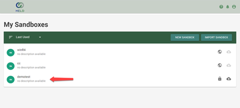
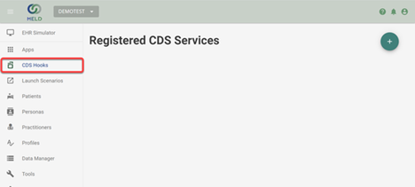
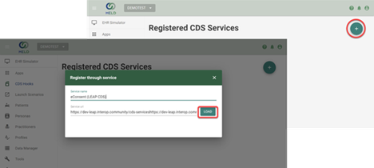
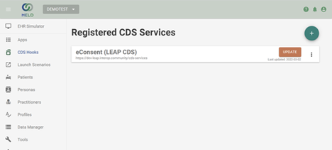
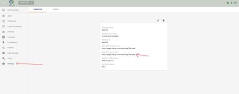
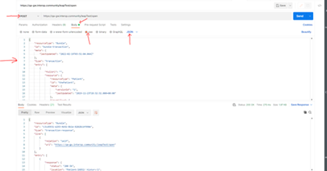
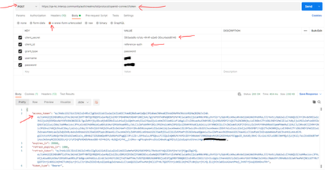
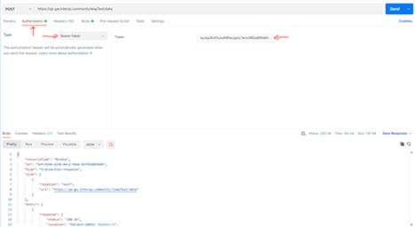

# eConsent (LEAP CDS) Functionality

## Registering eConsent (LEAP CDS) Functionality

Requirements:

1. CDS Endpoint

To access the LEAP CDS functionality available in the Meld Sandbox, first you will need to select the sandbox you would like to connect it to.

Next you will need to navigate to the CDS Hooks Section of the sandbox you selected.

To access the LEAP CDS service, you will need to register a new service using the correct link.

[To be changed to production when available]

[https://dev-leap.interop.community/cds-services](https://dev-leap.interop.community/cds-serviceshttps:/dev-leap.interop.community/cds-services)

You&#39;ll now see the LEAP CDS service available for use in your sandbox.

# Loading Persona Data Into Your Sandbox

Requirements

1. FHIR API endpoint URL
2. Postman
3. Test data is attached below:

Loading data to an open/unsecured endpoint in Meld sandbox is straightforward:

Locate the open FHIR API endpoint and copy the link

Paste the URL, select method, and add the content of the attached file in the body

_(Optional)_ For loading to a secured endpoint, a step to retrieve an authorization token is required.

Additional requirements for token retrieval:

1. Url for token: [https://qa-kc.interop.community/auth/realms/iol/protocol/openid-connect/token](https://qa-kc.interop.community/auth/realms/iol/protocol/openid-connect/token)
2. Client\_secret of authorizer on keycloak: 593ada9c-b1dc-444f-a2e6-30cc4add8146
3. Client\_id of authorizer on keycloak: reference-auth

Once received a token, add Authorization in the header

